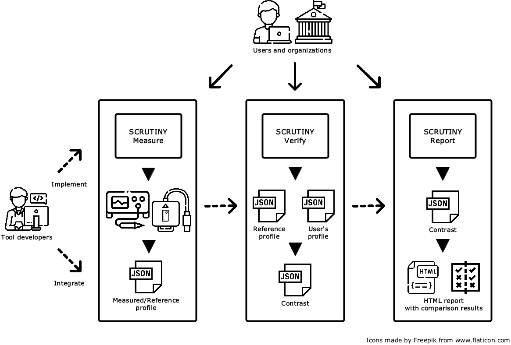

# SCRUTINY

[](https://github.com/crocs-muni/scrutiny/actions/workflows/pylint.yml)
[](https://github.com/crocs-muni/scrutiny/actions/workflows/flake8.yml)

An automated toolkit to analyze secure hardware, and build user-verifiable hardware profiles. SCRUTINY provides high-level frameworks to verify profiles against reference and produce detailed HTML reports. For now, SCRUTINY is capable of JavaCard smartcards, Trusted Platform Modules (TPM), self-encrypted disks (SED) and cryptographic libraries analysis and verification using domain-specific tools listed below.
<p align="center">
  
</p>

| Tool | Repo stats | Target domain | Info | Notes |
|----------|----------|----------|----------|----------|
| [JCAlgTest](https://github.com/crocs-muni/JCAlgTest)   |    | ![][javacard] ![][rsa] ![][ecc] | Automated testing tool for algorithms from JavaCard API supported by particular smart card. Performance testing of almost all available methods. The results for more than 100+ cards available at https://jcalgtest.org.    | |
|  [jcAIDScan](https://github.com/petrs/jcAIDScan)     |      | ![][javacard]   | An automated scanner for JavaCard packages installed and supported by target card. Evaluates all packages from JavaCard API specification up to JC API 3.0.5.  |    |
| [GlobalPlatformPro tool](https://github.com/martinpaljak/GlobalPlatformPro)    |        | ![][javacard]   | Mature tool for managing applets via GlobalPlatform   | Developed by M. Paljak   |
|[TPMAlgTest](https://github.com/crocs-muni/tpm2-algtest)    |         | ![][tpm] ![][rsa] ![][ecc]  | A scanner for Trusted Platform Module algorithms, performance and properties of cryptographic implementation.    |    |
|[scrutiny-power-traces-analyzer](https://github.com/crocs-muni/scrutiny-power-traces-analyzer)    |         | ![][javacard] |  The SCRUTINY analyzer for power traces of cryptographic operations captured from smartcards with three main modules implemented: Traces comparer, Trace classifier and CO template finder.  |    |
| [JCMathLib - ECPoint library](https://github.com/OpenCryptoProject/JCMathLib)  |       | ![][javacard] ![][rsa] ![][ecc]   | Provides software re-implementation of low-level operations like ECPoint or BigInteger without any use of proprietary API. Used for JavaCard capabilities testing.  |    |
| [ECTester](https://github.com/crocs-muni/ectester)  |        |  ![][javacard] ![][cryptolibs] ![][ecc] | ECTester is a tool for testing and analysis of elliptic curve cryptography implementations on JavaCards and in cryptographic libraries.  |    |
| [pyecsca](https://github.com/J08nY/pyecsca)  |       |  ![][javacard] ![][cryptolibs] ![][ecc] | Python Elliptic Curve cryptography Side-Channel Analysis toolkit. Reverse engineer the curve model, coordinate system, addition formulas, scalar multiplier and even finite-field implementation details from blackbox implementations using side-channels. |    |
| [ec-detector](https://github.com/crocs-muni/ec-detector)  |      | ![][cryptolibs] ![][ecc]   | EC detector is a code parser that can determine, with some degree of confidence, which elliptic curves a given piece of code contains.   |    |
| [minerva](https://github.com/crocs-muni/minerva)  |      | ![][javacard] ![][cryptolibs] ![][ecc]   | A testing tool for presence of the Minerva vulnerability in ECC timing leakage and  proof-of-concept code exploiting it. |    |
| [roca_detect](https://github.com/crocs-muni/roca)  |      | ![][javacard] ![][cryptolibs] ![][rsa]   | Tester of properties of keys vulnerable to Return of the Coppersmith’s Attack (CVE-2017-15361) allowing practical factorization of RSA keys from Infineon chips.  |    |
| [RSABias](https://github.com/crocs-muni/RSABias)  |        | ![][javacard] ![][cryptolibs] ![][rsa]   | Tester of statistical properties of RSA keys, which vary between different cryptographic libraries.   |    |
| [Javus](https://github.com/crocs-muni/Javus)  |       | ![][javacard]  | A testing framework for executing known logical attacks against the JavaCard platform. The behavioral characteristics of JCVM are retrieved.  |    |
| [JCProfilerNext](https://github.com/lzaoral/JCProfilerNext)  |       |  ![][javacard]   | Performance profiler for on-card JavaCard code. Provides a completely automated preprocessing, compilation, installation and profiling of JavaCard code on JavaCard smart cards. Produces interactive performance graphs. |    |
| [opal-toolset](https://github.com/crocs-muni/opal-toolset)  |       | ![][sed] ![][rng] | A set of tools for managing and analysing self-encrypting devices with Opal standard. |    |
| [Randomness Testing Toolkit](https://github.com/crocs-muni/randomness-testing-toolkit)  |       | ![][rng] | Set of statistical randomness tests (NIST STS, Dieherader, TestU01) unified under same interface and results evaluation. |    |
| [booltest](https://github.com/ph4r05/booltest)   |      | ![][rng] | Statical randomness testing tool for TRNG and PRNG generators based on boolean polynomials. |    |
| [cooltest](https://github.com/jirigav/cooltest/)  |       | ![][rng] | Statical randomness testing tool for TRNG and PRNG generators based on a histogram construction.   |    |
| [sec-certs](https://github.com/crocs-muni/sec-certs) |     | - | A tool for data scraping, analysis and adavnaced searching of security certificates from Common Criteria and FIPS 140-2/3 schemes.  |    |


## How does it work?

SCRUTINY will run set of open-source tools (see above) to gather information about your smart card, TPM, disk or cryptographic library. The information will be parsed and united into JSON profile. Such profile can be compared to reference, producing verification JSON profile, which can be transformed to HTML report, easily readable by a human.

Depending on a target you analyze (smartcard, TPM, disk, library...), the exact usage steps differ. The example below applies for smartcards with JavaCard platform. 

## Example usage

### 1. Download the repository

`$ git clone https://github.com/crocs-muni/scrutiny.git`

### 2. Run the set-up script

`$ python -u setup_script.py`

### 3. Analysis of smartcard with JavaCard platform


  3.1 Connect your Java Card

  3.2 Run SCRUTINY Java Card analysis

`$ python -u measure_javacard.py Supposedly_NXP_P60`

  3.3 Compare the profile with reference

`$ python -u verify.py --profile results/Supposedly_NXP_P60.json --reference database/NXP_P60.json -o NXP_P60_Verification.json`

  3.4 Produce HTML report

`$ python -u report_html.py -v NXP_P60_Verification.json -o NXP_P60_Verification_Report.html`

  3.5 Read the report (```NXP_P60_Verification_Report.html```) using web browser and learn about your JavaCard


## Detailed usage

Run any of the scripts with `-h/--help` to show detailed usage instructions.

## Dependencies

At least Python 3.8 with PIP, Java Runtime Environment.

## Limitations

SCRUTINY is limited by the tools it depends on. Selection from multiple connected smart cards in the measurement script is not supported. Please, have at most one card connected to the PC while performing SCRUTINY Measure for JavaCards.


[javacard]: https://img.shields.io/badge/platform-javacard-green
[tpm]: https://img.shields.io/badge/platform-tpm-blue
[cryptolibs]: https://img.shields.io/badge/platform-cryptolibs-yellow
[sed]: https://img.shields.io/badge/platform-sed-red

[rsa]: https://img.shields.io/badge/alg-RSA-red
[ecc]: https://img.shields.io/badge/alg-ECC-orange
[rng]: https://img.shields.io/badge/alg-rng-lightgray


